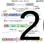
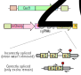

## RNA-linked CRISPR (ReliC) screening elucidates gene regulatory networks in human cells 

### Patrick Nugent
#### Subramaniam Lab
#### 5 June 2023

---

## mRNAs transfer information from genes to proteins

{width=65%}

---

## RNA metabolism is complex and involves thousands of RNA-binding proteins (RBPs)

{width=65%}

---

## mRNA metabolic pathways have primarily been characterized in yeast

### How can we identify the full complement of RBP networks that regulate these pathways in human cells?

---

## Pooled CRISPR screens are widely used for forward genetic screening in human cells

### Limitations: Disruption of RNA metabolism doesn't necessarily manifest with growth or viability defects

---

## FACS-based CRISPR screening uses protein level readouts for mRNA phenotypes

### Limitations: Disruption of RNA metabolism may not alter protein levels

<!-- Point out limitations -- essential - won't get any protein, compensatory networks -->

---

## FACS-based CRISPR screening uses protein level readouts for mRNA phenotypes

### *Can we measure RNA levels directly in a CRISPR screen?*

---

## Barcoding approaches can link CRISPR perturbations to RNA level readouts

{width=90%}

<element class="cite"> 
Muller, et al. Science 2020 
Alford, et al. eLife 2021

---

## How can mRNA barcode-linked CRISPR screening be implemented in human cells?

<!-- Problem is lack of clarity for how to implement in humans -- good points to make in paper as well. -->

---

## Workflow for ReLiC screens

{width=70%}

---

## Bxb1 integrase enables high efficiency single copy integration at defined genomic locus

{width=55%}

---

## Bxb1 integrase enables high efficiency single copy integration at defined genomic locus

{width=55%}

<!-- Mention that while this is a single slide, most results came in past few months and majority of time was spent on what goes into this slide. -->

---

## Validation of Cas9 activity

---

## First application of ReLiC screening strategy: Nonsense-mediated mRNA decay (NMD) pathway

{width=50%}

<!--If you knocked out an NMD factor, PTC counts / NTC counts should go up -->

---

## NMD Relic screen design

{width=50%}

---

<!-- .slide: data-visibility="hidden" -->
## ReliC screening identifies gene networks regulating NMD

{width=67%}

<!-- Comment that few pass FDR cutoff for NTC. Highlight that it hits expected stuff like ERF, LSU, etc. that have known roles, but have not bee hit in screns  -->

---

## Second application of ReLic screening strategy: Identifying factors involved in splicing

{width=60%}

<!--If you knocked out a splicing factor, intron counts / NTC counts should go up -->

---

<!-- .slide: data-visibility="hidden" -->
## ReliC screening for intron retention readily identifies splicing factors

{width=86%}

---

## Description of datasets you will working with

{width=60%}

---

## Description of datasets you will working with

{width=60%}

---